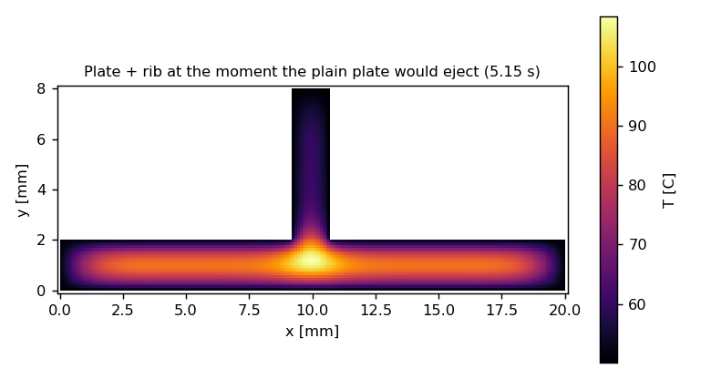
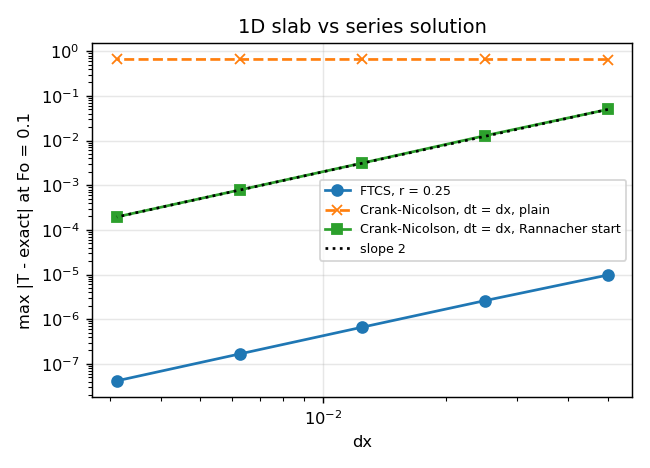
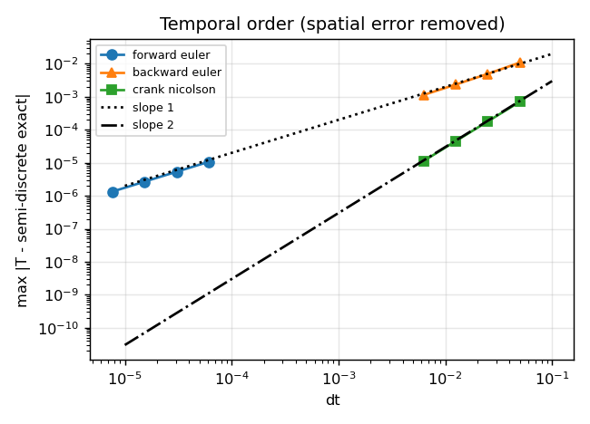
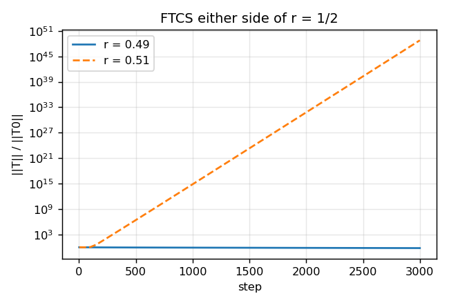
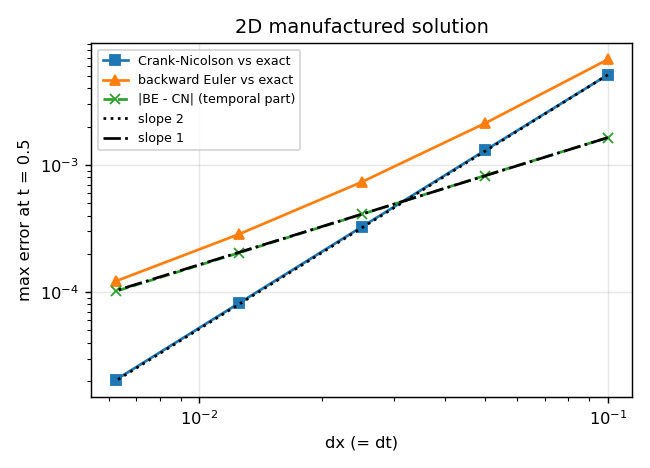
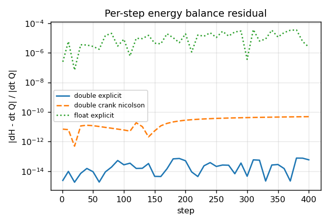
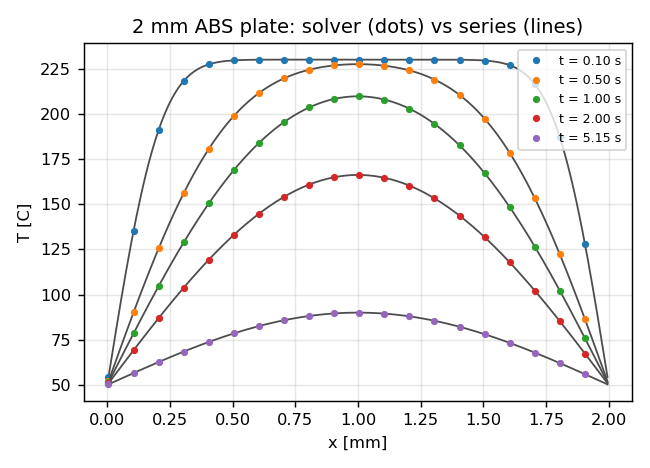
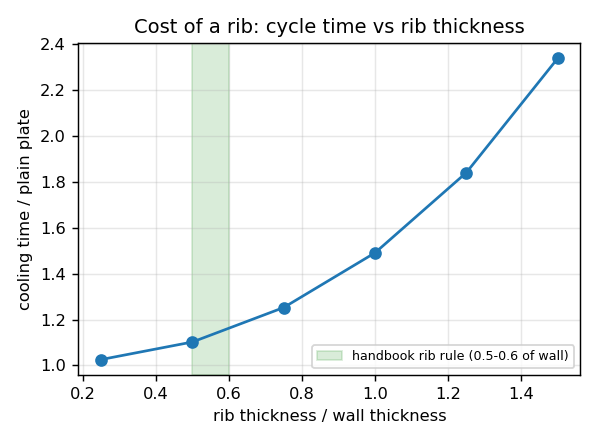
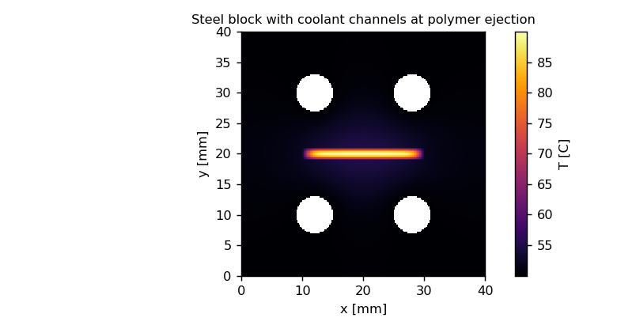
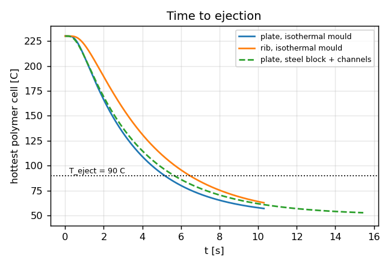

# moldcool

A 2D transient heat-conduction solver, written from first principles in C++17, that estimates
the cooling time of an injection-moulded part. Cooling is usually the largest slice of the
moulding cycle, and cycle time is what a costing quote is built on. The handbook formula used
for that estimate is the first term of a Fourier series for a flat plate; this solver reproduces
that formula for a plate and then shows what it misses for ribs, thick sections and a real steel
mould with coolant channels.

Everything numerical is verified against something exact: a series solution, a manufactured
solution, the semi-discrete eigenvalue, a stability bound, an energy identity, and Eigen's direct
solver. Convergence orders and stability limits are asserted in CI, not eyeballed.



*A 2 mm ABS plate with a 1.5 mm rib, at the moment the handbook formula says the plate is ready
to eject. The rib base is still at 108 C against an ejection limit of 90 C.*

## What is in the box

| Component | Where | Notes |
|---|---|---|
| Cell-centred finite volumes, harmonic-mean conductances, Dirichlet-at-face and adiabatic boundaries, per-cell materials | `include/moldcool/operator.hpp` | symmetric operator, second order |
| Theta time integration: forward Euler, Crank-Nicolson, backward Euler; Rannacher start-up | `include/moldcool/stepper.hpp` | explicit path is matrix-free |
| Matrix-free Jacobi-preconditioned conjugate gradient | `include/moldcool/cg.hpp` | cross-checked against Eigen LDLT and Eigen CG |
| Analytical references: slab series, cooling-time formula, manufactured solution, semi-discrete eigenvalue | `include/moldcool/analytic.hpp` | |
| Compensated summation for the energy audit | `include/moldcool/sum.hpp` | naive vs Kahan vs pairwise |
| Geometry builders: 1D slab and rod, unit square, plate+rib in an isothermal mould, plate in a steel block with coolant channels | `include/moldcool/core.hpp` | |
| VTK (ParaView) and CSV writers | `include/moldcool/io.hpp` | |
| Seven verification tests, each with convergence-order assertions | `tests/` | plain executables, exit code = failures |
| OpenMP on all stencil and CG loops, with a size guard | everywhere | see "things that went wrong" |
| CUDA explicit kernel, global-memory and shared-memory-tiled variants, checked against the CPU | `cuda/ftcs2d.cu` | |
| CPU benchmark and a performance regression gate | `bench/` | |
| Derivations on paper | `notes/derivations.md` | |

Everything is double by default and templated on the floating-point type; the energy test runs
the same case in float to show the difference.

## Verification

All numbers below are produced by `ctest` and written to `results/*.csv`; the plots are
`scripts/plots.py`. Machine: Ryzen 7 6800HS, g++ 14.2, `-O3`.

### 1D slab against the exact series (test `slab_convergence`)

Unit diffusivity, thickness 1, walls at 0, initial temperature 1, compared at Fourier number
0.1 in the max norm. Forward Euler at r = 0.25, and Crank-Nicolson with dt = dx, which at
N = 320 is 640 times the explicit limit.

| N | dx | FTCS error | order | CN plain | CN + Rannacher | order |
|---|---|---|---|---|---|---|
| 20 | 0.05 | 9.74e-6 | | 0.652 | 4.98e-2 | |
| 40 | 0.025 | 2.61e-6 | 1.90 | 0.654 | 1.29e-2 | 1.95 |
| 80 | 0.0125 | 6.63e-7 | 1.98 | 0.655 | 3.14e-3 | 2.04 |
| 160 | 0.00625 | 1.66e-7 | 1.99 | 0.655 | 7.82e-4 | 2.00 |
| 320 | 0.003125 | 4.16e-8 | 2.00 | 0.655 | 1.95e-4 | 2.00 |



The "CN plain" column is a deliberate, asserted failure. The initial condition is discontinuous
at the walls; Crank-Nicolson's amplification factor (1 - z/2)/(1 + z/2) tends to -1 for stiff
modes, so with a large time step the discontinuity's high modes flip sign every step and never
decay. Four backward-Euler half-steps at the start (Rannacher 1984) damp them and second order
is recovered. The test asserts that the plain run stays broken, so nobody "fixes" it by
accident.

### Temporal order with the spatial error removed (test `temporal_order`)

A rod with adiabatic ends and initial condition cos(pi x) is an exact eigenvector of the
discrete operator, so the semi-discrete solution is known in closed form,
T_i(t) = cos(pi x_i) exp(-alpha lambda_h t). Comparing against that instead of the PDE solution
isolates the time-integration error.

| scheme | dt | error | order |
|---|---|---|---|
| forward Euler | 6.10e-5 to 7.63e-6 | 1.07e-5 to 1.34e-6 | 1.000, 1.000, 1.000 |
| backward Euler | 0.05 to 0.00625 | 1.09e-2 to 1.13e-3 | 1.14, 1.08, 1.05 |
| Crank-Nicolson | 0.05 to 0.00625 | 7.10e-4 to 1.13e-5 | 1.98, 2.00, 2.00 |



The same test checks that lambda_h converges to pi^2 at second order in dx.

### Stability either side of r = 1/2 (test `stability`)

FTCS on the slab with N = 200 for 3000 steps. Because the amplification matrix is symmetric,
the 2-norm of the solution must be non-increasing for r <= 1/2 and grow otherwise.

| r | norm after 3000 steps |
|---|---|
| 0.49 | 0.627 (decays) |
| 0.51 | 6.2e48 |



The Gershgorin bound in the code (dt <= min mass/aP) gives r <= 1/3 because wall cells carry a
larger diagonal; the test records both and confirms the sharp limit is 1/2.

### 2D manufactured solution (test `mms_2d`)

T = exp(-t) sin(pi x) sin(pi y) with the matching source term, unit square, homogeneous
Dirichlet, dt = dx (2N times the explicit limit), compared at t = 0.5.

| N | CN error | order | CG iters | BE error | BE - CN | order of BE - CN |
|---|---|---|---|---|---|---|
| 10 | 5.13e-3 | | 16 | 6.77e-3 | 1.64e-3 | |
| 20 | 1.30e-3 | 1.98 | 35 | 2.13e-3 | 8.26e-4 | 0.99 |
| 40 | 3.26e-4 | 2.00 | 59 | 7.36e-4 | 4.09e-4 | 1.01 |
| 80 | 8.17e-5 | 2.00 | 83 | 2.85e-4 | 2.04e-4 | 1.01 |
| 160 | 2.04e-5 | 2.00 | 122 | 1.22e-4 | 1.02e-4 | 1.00 |



Backward Euler's error against the exact solution mixes O(dt) and O(dx^2) at these sizes
(observed 1.7 to 1.2, drifting toward 1). Subtracting the Crank-Nicolson solution on the
identical grid removes the shared spatial error and leaves a clean first-order term.

### Energy balance and floating point (test `energy_balance`)

The scheme is conservative: internal fluxes cancel in pairs, so per step
H(n+1) - H(n) = dt [theta Q(n+1) + (1 - theta) Q(n)] exactly in real arithmetic. Measured on
the plate+rib geometry:

| run | max per-step residual | cumulative | naive vs Kahan sum |
|---|---|---|---|
| double, explicit | 1.0e-13 | 3.5e-15 | 3e-16 |
| double, Crank-Nicolson (CG tol 1e-12) | 4.8e-11 | 5.3e-12 | 4e-15 |
| float, explicit | 5.5e-5 | 1.8e-6 | 1.7e-7 |



The explicit residual is round-off; the implicit residual is the CG tolerance showing through;
the float run is eight orders worse. The same test checks K is symmetric with random vectors
(1.3e-16).

### Hand-written CG against Eigen (test `cg_vs_eigen`)

The implicit matrix is assembled as an `Eigen::SparseMatrix`, solved with `SimplicialLDLT` and
Eigen's `ConjugateGradient`, and compared with the matrix-free solution: max relative difference
1.2e-13, 25 iterations here versus Eigen's 24.

### Validation: the cooling-time formula (test `cooling_time`)

ABS, melt 230 C, mould 50 C, ejection when the hottest point reaches 90 C.

| plate thickness | formula | full series | solver (FTCS) | solver (CN) |
|---|---|---|---|---|
| 1 mm | 1.2876 s | 1.2876 s | 1.2875 s | 1.2877 s |
| 2 mm | 5.1505 s | 5.1505 s | 5.1500 s | 5.1506 s |
| 3 mm | 11.589 s | 11.589 s | 11.588 s | 11.589 s |
| 4 mm | 20.602 s | 20.602 s | 20.600 s | 20.603 s |

Relative error 9e-5 (FTCS, N = 100) and 4e-5 (CN). The one-term formula is itself within 1e-6 of
the full series at these Fourier numbers, which is why costing tools get away with it for flat
walls.



## What the formula cannot see

`moldcool rib results` and `moldcool conjugate results` produce these.

**Ribs.** Plate 20 x 2 mm with a 6 mm tall rib of varying thickness, isothermal mould.

| rib / wall | cooling time | vs plain plate |
|---|---|---|
| 0.25 | 5.29 s | +3% |
| 0.50 | 5.68 s | +10% |
| 0.75 | 6.46 s | +25% |
| 1.00 | 7.68 s | +49% |
| 1.25 | 9.48 s | +84% |
| 1.50 | 12.05 s | +134% |



The DFM handbooks say ribs should be 0.5 to 0.6 of the wall. The solver puts a number on the
rule: that is the knee below which the rib costs about a tenth of the cycle, and above which the
cost grows roughly with the square of the local thickness, as the h^2 in the formula predicts.

**The mould itself.** The isothermal-wall assumption behind the formula says the steel surface
stays at 50 C. Put the same 2 mm plate in a 40 x 40 mm P20 block with four 6 mm coolant channels
at 50 C and let the steel conduct:




The polymer surface warms the steel around it and ejection moves from 5.15 s to 5.65 s (+10%)
for a single shot from a uniformly warm mould. A production mould runs at a cyclic steady state
where that surface is warmer still; see Limitations.

## Performance

Explicit stencil throughput in million cell updates per second on a 2048 x 2048 grid
(4.2 M unknowns), double precision.

| where | MLUPS | vs CPU serial |
|---|---|---|
| CPU serial, Ryzen 7 6800HS | 163 | 1.0x |
| CPU OpenMP, 16 threads | 208 | 1.3x |
| GPU, RTX 3060 Laptop, plain global-memory kernel | 4040 | 24.8x |
| GPU, same, shared-memory tiled | 3546 | 21.8x |

The GPU result matches the CPU stepper after 200 steps to 1.3e-15 relative.

Two things worth saying about that table rather than hiding them. OpenMP buys only 1.3x
because the kernel is memory-bound: every cell reads six coefficient arrays plus temperature and
writes one, about 64 bytes per update, and a laptop's DRAM bandwidth is the ceiling, not the
cores. The obvious fix, which I have not done, is a uniform-material fast path that stores no
per-cell coefficients and cuts traffic by four. And the shared-memory tile is slower than the
plain kernel on Ampere: the halo reuse it buys is already served by L1, and the extra
`__syncthreads` and tile fills cost more than they save. I kept both kernels because measuring
that is the point.

The implicit side has its own lesson: a Crank-Nicolson step on 1024^2 with dt = dx takes 642
Jacobi-CG iterations (5.7 s serial-equivalent). Jacobi is the wrong preconditioner at that
stiffness; multigrid or an incomplete Cholesky factorisation is the next lever, and a CUDA CG
after that.

`bench/check_perf.py` compares a run against `bench/baseline.json` and fails below a fraction
of the baseline. CI uses a loose gate (0.5) because hosted runners vary; the tight local gate
is meant for a fixed machine.

## Things that went wrong, and what they taught

- **Crank-Nicolson did not converge on the slab.** Error stuck at 0.65 across five grids. Cause:
  ringing on the discontinuous initial condition with a large time step. Fix: Rannacher start-up.
  The failing run is now a regression test.
- **The test suite took 52 s; single-threaded it took 3.8 s.** Every CG iteration opened several
  OpenMP regions over a 100-cell grid and paid the thread wake-up each time. Fix: an
  `if (n >= 32768)` clause on every pragma. The suite runs in 11 s now, most of it MMS at N = 160.
- **The CLI crashed inside `std::ofstream` while the tests ran fine.** The MinGW binary loaded
  Git for Windows' older `libstdc++-6.dll` from PATH. Fix: static linking on MinGW. The tests
  never hit it because they use `fopen`.
- **A rib 0.75 of the wall added 25% to the cooling time, not the 50% I had guessed** when I
  wrote the assertion. The number is the result; the assertion now asks for a clear increase and
  the sweep table records the real curve.
- **Backward Euler measured order 1.3.** Not a bug: mixed O(dt) and O(dx^2) error at pre-
  asymptotic resolution, plus a step count that was not halving with dx. Fixed the step count and
  measured the temporal term by differencing against Crank-Nicolson on the same grid.

## Method, briefly

Cell-centred finite volumes on a uniform grid. Face conductance g = k_f A / d with k_f the
harmonic mean, so the operator is symmetric and handles polymer against steel correctly. A cell
flagged Fixed imposes its temperature on the shared face at half-cell distance, which keeps
Dirichlet walls second order. Faces to nothing are adiabatic. Time integration is the theta
method; theta = 0 never forms a matrix, theta > 0 solves (M/dt + theta K) with matrix-free
Jacobi-preconditioned CG, which is admissible because that matrix is symmetric positive
definite. Ejection time is the first crossing of the hottest cell below T_eject, interpolated
linearly between steps. All derivations, including the von Neumann and Gershgorin bounds, the
CN amplification factor, the energy identity and the cooling-time formula from the series, are
in [notes/derivations.md](notes/derivations.md).

## Build and run

```
cmake -S . -B build -DCMAKE_BUILD_TYPE=Release -DMOLDCOOL_WITH_EIGEN=ON
cmake --build build
cd build && ctest --output-on-failure          # writes results/*.csv
cd .. && ./build/moldcool all results          # slab, rib, conjugate cases (CSV + VTK)
python scripts/plots.py                        # results/*.png
./build/moldcool_bench 2048 50 | python bench/check_perf.py --profile local
```

Requirements: CMake 3.16+, a C++17 compiler; OpenMP optional; Eigen optional (fetched
automatically if the option is on and it is not installed); Python with NumPy and Matplotlib for
the plots. Open `results/*.vtk` in ParaView for the fields (apply Cell Data to Point Data for
smooth contours).

CUDA benchmark, built and run here from WSL2 with a user-space toolchain (no root needed):

```
micromamba create -n cuda -c conda-forge -c nvidia cuda-nvcc cuda-cudart-dev cuda-version=12.8 gxx=13
micromamba run -n cuda nvcc -O3 -std=c++17 -arch=sm_86 -Iinclude cuda/ftcs2d.cu -o moldcool_cuda_bench
./moldcool_cuda_bench 2048 200
```

or `cmake -DMOLDCOOL_CUDA=ON` with a normal CUDA install. CI (`.github/workflows/ci.yml`)
builds with GCC on Ubuntu and MSVC on Windows, runs all tests, and applies the perf gate.

## Materials

Constant properties, representative mid-range values:

| material | k [W/mK] | rho [kg/m3] | cp [J/kgK] | alpha [m2/s] |
|---|---|---|---|---|
| ABS | 0.20 | 1040 | 1400 | 1.37e-7 |
| PP | 0.22 | 905 | 1900 | 1.28e-7 |
| P20 steel | 29 | 7850 | 460 | 8.0e-6 |

Sources: Osswald, Turng, Gramann, *Injection Molding Handbook* (Hanser), materials tables;
Menges, Michaeli, Mohren, *How to Make Injection Molds* (Hanser), ch. 8 for the cooling-time
formula and the rib rule; Carslaw and Jaeger, *Conduction of Heat in Solids*, sec. 3.3 for the
slab series; Rannacher, *Finite element solution of diffusion problems with irregular data*,
Numer. Math. 43 (1984) for the start-up; LeVeque, *Finite Difference Methods for ODEs and PDEs*
(SIAM) for the stability and truncation analysis.

## Limitations

- Constant properties. Semi-crystalline polymers (PP) release latent heat on crystallisation and
  every polymer's k and cp vary with temperature; both lengthen real cooling times.
- Perfect thermal contact between polymer and steel. Real parts shrink away from the wall; a
  contact conductance (Robin condition) belongs at that interface.
- 2D cross-sections. Bosses and corners are 3D.
- Single shot from a uniform mould temperature. A production mould reaches a cyclic steady state
  with a warmer surface; the conjugate case underestimates that effect.
- Cooling starts from a uniform melt temperature at t = 0. Filling and packing come first.
- Uniform Cartesian grid. Curved geometry needs an unstructured mesh (Gmsh) or a cut-cell
  treatment.

## What I would do next

Hele-Shaw mould filling (pressure Poisson equation with a Cross-WLF melt viscosity), which
together with this solver gives the two halves of a cycle-time estimate; a multigrid or IC(0)
preconditioner and a CUDA CG so the implicit path scales like the explicit one; the uniform-
material fast path for the stencil; 3D; temperature-dependent properties with latent heat.

## Layout

```
include/moldcool/   core.hpp operator.hpp cg.hpp stepper.hpp analytic.hpp sum.hpp io.hpp
src/moldcool.cpp    CLI: slab | rib | conjugate | all
tests/              seven verification executables + check.hpp
bench/              bench.cpp, check_perf.py, baseline.json
cuda/ftcs2d.cu      GPU explicit kernels + CPU cross-check
scripts/plots.py    figures from results/*.csv
notes/derivations.md
results/            CSV tables, PNG figures, bench JSON (VTK fields are regenerated, not committed)
```

MIT license.
